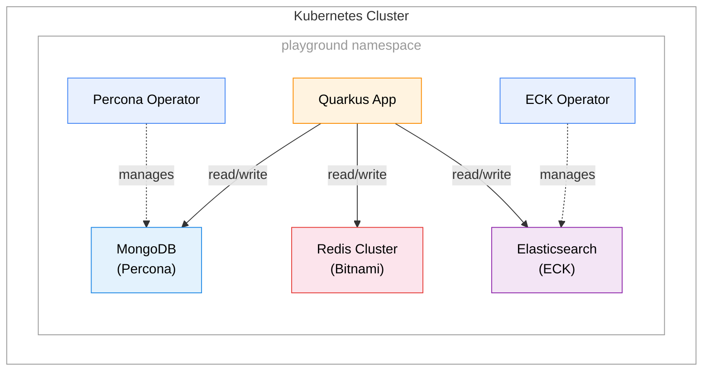

# quarkus-playground

This project uses Quarkus, the Supersonic Subatomic Java Framework.

If you want to learn more about Quarkus, please visit its website: <https://quarkus.io/>.

## Features

- **REST API** with Kotlin coroutines support
- **MongoDB** integration using the reactive client
- **Redis Cluster** integration using the reactive Quarkus Redis client
- **Elasticsearch** integration for full-text search on notes (dual-write from MongoDB)
- **Kubernetes deployment** with Helm charts, Percona MongoDB Operator, Bitnami Redis Cluster, and ECK Elasticsearch

## API Endpoints

### Greeting

| Method | Endpoint | Description |
|--------|----------|-------------|
| GET | `/hello?name={name}` | Returns a greeting message |

### Notes (MongoDB CRUD + Elasticsearch Search)

| Method | Endpoint | Description |
|--------|----------|-------------|
| GET | `/notes` | List all notes |
| GET | `/notes/{id}` | Get a note by ID |
| GET | `/notes/search` | Search notes via Elasticsearch |
| POST | `/notes` | Create a new note (also indexed in Elasticsearch) |
| PUT | `/notes/{id}` | Update an existing note (also re-indexed in Elasticsearch) |
| DELETE | `/notes/{id}` | Delete a note (also removed from Elasticsearch) |

**Search query parameters** (at least one required):

| Parameter | Description |
|-----------|-------------|
| `q` | Full-text search across both title and content |
| `title` | Match on title field only |
| `content` | Match on content field only |

Parameters can be combined (AND logic). Examples:

```shell script
# Search across both title and content
curl "http://localhost:8080/notes/search?q=kotlin"

# Search by title only
curl "http://localhost:8080/notes/search?title=guide"

# Search by content only
curl "http://localhost:8080/notes/search?content=tutorial"

# Combine title and content filters
curl "http://localhost:8080/notes/search?title=kotlin&content=advanced"
```

**Request/Response format:**

```json5
// POST/PUT request body
{
  "title": "My Note",
  "content": "Note content here"
}
```
```json5
// Response (also used by search)
{
  "id": "507f1f77bcf86cd799439011",
  "title": "My Note",
  "content": "Note content here"
}
```

### Increment (Redis CRUD)

| Method | Endpoint | Description |
|--------|----------|-------------|
| GET | `/increment` | List all keys |
| GET | `/increment/{key}` | Get value for a key |
| POST | `/increment` | Create a new key with initial value |
| PUT | `/increment/{key}` | Increment a key by a value |
| DELETE | `/increment/{key}` | Delete a key |

**Request/Response format:**

```json5
// POST request body
{
  "key": "my-counter",
  "value": 0
}
```
```json5
// GET response
{
  "key": "my-counter",
  "value": 42
}
```

## Running the application in dev mode

You can run your application in dev mode that enables live coding using:

```shell script
./gradlew quarkusDev
```

> **_NOTE:_** In dev mode, Quarkus Dev Services automatically starts MongoDB, Redis, and Elasticsearch containers. No manual setup required!

> **_NOTE:_**  Quarkus now ships with a Dev UI, which is available in dev mode only at <http://localhost:8080/q/dev/>.

## Packaging and running the application

The application can be packaged using:

```shell script
./gradlew build
```

It produces the `quarkus-run.jar` file in the `build/quarkus-app/` directory.
Be aware that it's not an _über-jar_ as the dependencies are copied into the `build/quarkus-app/lib/` directory.

The application is now runnable using `java -jar build/quarkus-app/quarkus-run.jar`.

If you want to build an _über-jar_, execute the following command:

```shell script
./gradlew build -Dquarkus.package.jar.type=uber-jar
```

The application, packaged as an _über-jar_, is now runnable using `java -jar build/*-runner.jar`.

## Creating a native executable

You can create a native executable using:

```shell script
./gradlew build -Dquarkus.native.enabled=true
```

Or, if you don't have GraalVM installed, you can run the native executable build in a container using:

```shell script
./gradlew build -Dquarkus.native.enabled=true -Dquarkus.native.container-build=true
```

You can then execute your native executable with: `./build/quarkus-playground-1.0.0-SNAPSHOT-runner`

If you want to learn more about building native executables, please consult <https://quarkus.io/guides/gradle-tooling>.

## Kubernetes Deployment

The project includes a [Helm](https://helm.sh/) chart in the `helm/quarkus-playground/` directory for deploying the application to a Kubernetes cluster. All components — including the [Percona Operator for MongoDB](https://docs.percona.com/percona-operator-for-mongodb/), the [ECK (Elastic Cloud on Kubernetes)](https://www.elastic.co/guide/en/cloud-on-k8s/current/k8s-overview.html) operator, and the application itself — are deployed in a single `playground` namespace so that operator-generated secrets are directly accessible.

### Architecture



All components are deployed in the `playground` namespace so that secrets created by the operators are accessible to the application. The Percona Operator manages the MongoDB cluster, and the ECK Operator manages the Elasticsearch cluster. The Bitnami Redis Cluster is deployed as a Helm subchart. The Quarkus application connects to MongoDB using credentials automatically generated by Percona, to Redis Cluster via the headless service, and to Elasticsearch via the ECK-managed HTTP service.

### Directory Structure

```
helm/
└── quarkus-playground/
    ├── Chart.yaml                       # Helm chart metadata
    ├── Chart.lock                       # Dependency lock file
    ├── values.yaml                      # Default configuration values
    ├── mongo-values.yaml                # Percona MongoDB values (production)
    ├── mongo-local-values.yaml          # Percona MongoDB values (local/dev)
    ├── redis-values.yaml                # Bitnami Redis Cluster values
    ├── eck-stack-values.yaml            # ECK Elasticsearch values
    ├── charts/                          # Packaged dependency charts
    │   ├── psmdb-db-1.21.2.tgz         # Percona MongoDB chart dependency
    │   └── redis-cluster-13.0.4.tgz    # Bitnami Redis Cluster chart dependency
    └── templates/
        ├── _helpers.tpl                 # Template helpers
        ├── namespace.yaml               # Namespace template
        ├── deployment.yaml              # Deployment template
        └── service.yaml                 # Service template
.helmignore                              # Files to exclude from Helm packaging
```

### Prerequisites

**1. Add Helm repositories:**

```shell script
helm repo add percona https://percona.github.io/percona-helm-charts/
helm repo add elastic https://helm.elastic.co
helm repo add bitnami https://charts.bitnami.com/bitnami
helm repo update
```

**2. Create the namespace** for the application:

```shell script
kubectl create namespace playground
```

**3. Install the Percona MongoDB Operator:**

```shell script
helm install psmdb-operator percona/psmdb-operator \
  --namespace playground
```

**4. Install the ECK (Elastic Cloud on Kubernetes) Operator:**

```shell script
helm install elastic-operator elastic/eck-operator \
  --namespace playground
```

### Configuration

Key values in `values.yaml`:

| Parameter | Description | Default |
|-----------|-------------|---------|
| `namespace.create` | Create namespace | `false` |
| `namespace.name` | Namespace name | `playground` |
| `quarkus.replicaCount` | Number of app replicas | `1` |
| `quarkus.image.repository` | Image repository | `quarkus/quarkus-playground` |
| `quarkus.image.tag` | Image tag | `1.0` |
| `quarkus.image.pullPolicy` | Image pull policy | `IfNotPresent` |
| `quarkus.service.type` | Service type | `NodePort` |
| `quarkus.service.port` | Service port | `8080` |
| `quarkus.resources.requests.memory` | Memory request | `128Mi` |
| `quarkus.resources.requests.cpu` | CPU request | `100m` |
| `quarkus.resources.limits.memory` | Memory limit | `256Mi` |
| `quarkus.resources.limits.cpu` | CPU limit | `500m` |

> **Note:** The application automatically reads MongoDB credentials from the Percona-generated secret (`<clusterName>-mongo-secrets`).

### Building the Docker Image

Before deploying, build the JVM Docker image:

```shell script
./gradlew build
docker build -f src/main/docker/Dockerfile.jvm -t quarkus/quarkus-playground:1.0 .
```

### Deploying to Kubernetes

**Ensure MongoDB is running first** (see Prerequisites above).

#### Preview the generated manifests:

```shell script
helm template my-release helm/quarkus-playground/ \
  --values helm/quarkus-playground/values.yaml \
  --values helm/quarkus-playground/mongo-values(|-local).yaml \
  --values helm/quarkus-playground/redis-values.yaml \
  --values helm/quarkus-playground/eck-stack-values.yaml
```

#### Install the Helm chart:

```shell script
helm install my-release helm/quarkus-playground/ \
  --namespace playground \
  --values helm/quarkus-playground/values.yaml \
  --values helm/quarkus-playground/mongo-values(|-local).yaml \
  --values helm/quarkus-playground/redis-values.yaml \
  --values helm/quarkus-playground/eck-stack-values.yaml
```

#### Upgrade an existing release:

```shell script
helm upgrade my-release helm/quarkus-playground/ \
  --namespace playground \
  --values helm/quarkus-playground/values.yaml \
  --values helm/quarkus-playground/mongo-values(|-local).yaml \
  --values helm/quarkus-playground/redis-values.yaml \
  --values helm/quarkus-playground/eck-stack-values.yaml
```

#### Override values during installation:

```shell script
helm install my-release helm/quarkus-playground/ \
  --namespace playground \
  --values helm/quarkus-playground/values.yaml \
  --values helm/quarkus-playground/mongo-values(|-local).yaml \
  --values helm/quarkus-playground/redis-values.yaml \
  --values helm/quarkus-playground/eck-stack-values.yaml \
  --set quarkus.replicaCount=3 \
  --set quarkus.image.tag=2.0
```

### Accessing the Application

Once deployed, access the application via the NodePort service:

```shell script
# Get the NodePort assigned to the service
kubectl get svc -n playground

# Access the application (replace <NODE_IP> and <NODE_PORT> with actual values)
curl http://<NODE_IP>:<NODE_PORT>/hello
curl http://<NODE_IP>:<NODE_PORT>/notes
curl http://<NODE_IP>:<NODE_PORT>/notes/search?q=example
curl http://<NODE_IP>:<NODE_PORT>/increment
```

### Cleanup

To remove all deployed resources:

**1. Remove the Quarkus application:**

```shell script
helm uninstall my-release --namespace playground
```

**2. Clean up remaining resources** (PVCs and Secrets are retained by default to prevent data loss):

```shell script
# List and delete PVCs
kubectl get pvc -n playground
kubectl delete pvc -l app.kubernetes.io/instance={my-release}-mongo -n playground

# List and delete Secrets
kubectl get secrets -n playground
kubectl delete secret -l app.kubernetes.io/instance={my-release}-mongo -n playground
```

**3. Remove the Percona Operator** (optional, if no other MongoDB clusters depend on it):

```shell script
helm uninstall psmdb-operator --namespace playground
```

**4. Remove the ECK Operator** (optional, if no other Elasticsearch clusters depend on it):

```shell script
helm uninstall elastic-operator --namespace playground
kubectl delete crd `kubectl get crds -o custom-columns=NAME:.metadata.name | grep k8s.elastic.co` --namespace playground
```

**5. Delete the namespace** (optional):

```shell script
kubectl delete namespace playground
```

> **Note:** See the [Percona documentation](https://docs.percona.com/percona-operator-for-mongodb/delete.html) and [ECK documentation](https://www.elastic.co/guide/en/cloud-on-k8s/current/k8s-uninstalling-eck.html) for detailed cleanup instructions.

### Percona MongoDB Values Files

Two configuration files are provided for deploying MongoDB:

| File | Use Case              | Replicas | Sharding |
|------|-----------------------|----------|----------|
| `mongo-local-values.yaml` | Local                 | 1 | Disabled |
| `mongo-values.yaml` | Development | 3 | Enabled |

**Local values** use relaxed settings (`unsafeFlags.replsetSize: true`) suitable for single-node development clusters.

**Development values** configure a 3-node replica set with sharding enabled for high availability and horizontal scaling.

> **Note:** The Helm chart includes MongoDB, Redis Cluster, and Elasticsearch as dependencies (defined in `Chart.yaml`). The dependency charts are packaged in the `charts/` directory and locked in `Chart.lock`. To update dependencies, run `helm dependency update helm/quarkus-playground/`.

### Elasticsearch Configuration

Elasticsearch is deployed using the [ECK Stack Helm chart](https://www.elastic.co/guide/en/cloud-on-k8s/current/k8s-stack-helm-chart.html) as a subchart dependency. The configuration is defined in `eck-stack-values.yaml`.

| Feature | Configuration |
|---------|---------------|
| Version | 9.3.0 |
| Nodes | 1 (single node) |
| Memory | 2Gi (requests and limits) |
| TLS | Disabled (HTTP) |
| Kibana | Disabled |

The Quarkus application connects to Elasticsearch via the ECK-managed service at `elasticsearch-es-http.<namespace>.svc.cluster.local:9200`. Credentials are read from the `elasticsearch-es-elastic-user` secret auto-created by the ECK Operator.

Notes are automatically indexed into Elasticsearch when created or updated via the REST API, and removed from the index when deleted (dual-write pattern).

### Redis Cluster Configuration

Redis is deployed using the Bitnami Redis Cluster Helm chart as a subchart dependency. The configuration is defined in `redis-values.yaml`.

| Feature | Configuration |
|---------|---------------|
| Cluster Mode | 6 nodes (3 masters + 3 replicas) |
| Authentication | Disabled (for local development) |
| Persistence | Enabled with 8Gi PVC per node |
| Client Type | Cluster |

The Quarkus application connects to Redis via the headless service at `<release>-redis-cluster-headless.<namespace>.svc.cluster.local:6379`.

## Future Enhancements

The MongoDB setup supports additional features:

- **Backups**: Enable in `mongo-values.yaml` and configure storage (S3, GCS, Azure)
- **Monitoring**: Enable PMM (Percona Monitoring and Management) integration
- **Failover Testing**: The 3-node replica set supports automatic failover

## Related Guides

- Kotlin ([guide](https://quarkus.io/guides/kotlin)): Write your services in Kotlin
- MongoDB ([guide](https://quarkus.io/guides/mongodb)): Connect to MongoDB datastores
- Redis ([guide](https://quarkus.io/guides/redis)): Connect to Redis datastores
- Elasticsearch ([guide](https://quarkus.io/guides/elasticsearch)): Connect to Elasticsearch clusters
- Percona Operator ([docs](https://docs.percona.com/percona-operator-for-mongodb/)): MongoDB operator for Kubernetes
- Bitnami Redis Cluster ([chart](https://github.com/bitnami/charts/tree/main/bitnami/redis-cluster)): Redis Cluster Helm chart
- ECK Operator ([docs](https://www.elastic.co/guide/en/cloud-on-k8s/current/k8s-overview.html)): Elasticsearch operator for Kubernetes
