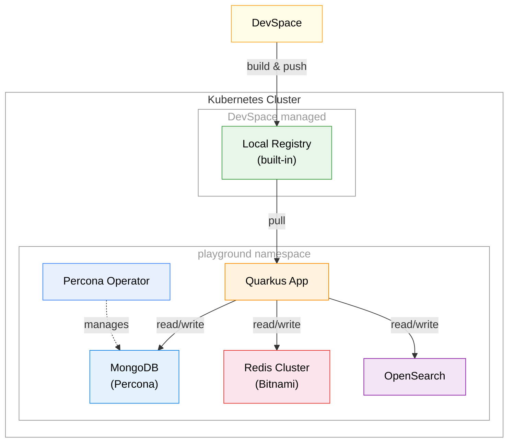

# quarkus-playground

This project uses Quarkus, the Supersonic Subatomic Java Framework.

If you want to learn more about Quarkus, please visit its website: <https://quarkus.io/>.

## Features

- **REST API** with Java virtual threads (`@RunOnVirtualThread`) and Jackson serialization
- **MongoDB** integration using the blocking client on virtual threads
- **Redis Cluster** integration using the blocking Quarkus Redis client on virtual threads
- **OpenSearch** integration for full-text search on notes (dual-write from MongoDB)
- **Kubernetes deployment** with separate Helm charts for infrastructure (MongoDB, Redis, OpenSearch) and the application
- **DevSpace dev workflow** with profile-based infra/app separation, hot reload via file sync, and in-cluster image builds

> **Why Java instead of Kotlin?** The project was originally written in Kotlin, but Quarkus dev mode hot reload was unreliable when used with Kotlin serialization. Switching to Java with Jackson and virtual threads resolved the hot reload issues while keeping the code simple and synchronous.

## API Endpoints

### Greeting

| Method | Endpoint | Description |
|--------|----------|-------------|
| GET | `/hello?name={name}` | Returns a greeting message |

### Notes (MongoDB CRUD + OpenSearch Search)

| Method | Endpoint | Description |
|--------|----------|-------------|
| GET | `/notes` | List all notes |
| GET | `/notes/{id}` | Get a note by ID |
| GET | `/notes/search` | Search notes via OpenSearch |
| POST | `/notes` | Create a new note (also indexed in OpenSearch) |
| PUT | `/notes/{id}` | Update an existing note (also re-indexed in OpenSearch) |
| DELETE | `/notes/{id}` | Delete a note (also removed from OpenSearch) |

**Search query parameter**

| Parameter | Description |
|-----------|-------------|
| `q` | Full-text search across both title and content |

Example:

```shell script
# Search across both title and content
curl "http://localhost:8080/notes/search?q=kotlin"
```

**Request/Response format:**

```json5
// POST/PUT request body
{
  "title": "My Note",
  "content": "Note content here"
}
```
```json5
// Response (also used by search)
{
  "id": "507f1f77bcf86cd799439011",
  "title": "My Note",
  "content": "Note content here"
}
```

### Increment (Redis CRUD)

| Method | Endpoint | Description |
|--------|----------|-------------|
| GET | `/increment` | List all keys |
| GET | `/increment/{key}` | Get value for a key |
| POST | `/increment` | Create a new key with initial value |
| PUT | `/increment/{key}` | Increment a key by a value |
| DELETE | `/increment/{key}` | Delete a key |

**Request/Response format:**

```json5
// POST request body
{
  "key": "my-counter",
  "value": 0
}
```
```json5
// GET response
{
  "key": "my-counter",
  "value": 42
}
```

## Running the application in dev mode

You can run your application in dev mode that enables live coding using:

```shell script
./gradlew quarkusDev
```

> **_NOTE:_** In dev mode, Quarkus Dev Services automatically starts MongoDB, Redis, and OpenSearch containers. No manual setup required!

> **_NOTE:_**  Quarkus now ships with a Dev UI, which is available in dev mode only at <http://localhost:8080/q/dev/>.

### DevSpace Dev Workflow

[DevSpace](https://devspace.sh/) automates the build-deploy-debug loop for Kubernetes. The configuration uses named pipelines and a `dev` profile so infra and app lifecycles can be managed independently.

#### Pipelines and Profiles

| Pipeline / Command | Profile | DevSpace Command | Description |
|--------------------|---------|-----------------|-------------|
| `infra` | (default) | `devspace run infra` | Deploy only infrastructure with production-like values |
| `infra-local` | `dev` | `devspace run infra-local` | Deploy infrastructure with lightweight single-node MongoDB |
| `app` | (default) | `devspace run app` | Build and deploy only the Quarkus application |
| `dev` | `dev` | `devspace run dev` | App with dev Dockerfile, hot reload, and port-forward |
| `deploy` | (default) | `devspace deploy` | Full stack — build image + deploy infra + deploy app |
| (remote dev) | `remote-dev` | `REMOTE_DEV=true devspace dev` | In-cluster builds; auto-activates when `REMOTE_DEV=true` |

#### Daily Workflow

```shell script
# Deploy infrastructure once (lightweight local setup)
devspace run infra-local

# Iterate on the app — restart as many times as you want, infra stays up
devspace run dev

# Tear down all deployed resources when done
devspace purge
```

#### Full Stack (One Command)

For a quick start or CI, deploy everything at once:

```shell script
devspace deploy
```

This builds the image and deploys both infra (with production-like values) and the app.

#### Local Dev

`devspace run dev` (equivalent to `devspace dev --profile dev`) activates the `dev` profile which:
- Builds with `Dockerfile.dev` running Quarkus Dev Mode
- Syncs Java source files and Gradle config into the running container for hot reload
- Overrides the MongoDB connection to use the non-sharded endpoint (matching `infra-local`)
- Port-forwards the application to `localhost:8080` and JDWP debugger to `localhost:5005`

#### Remote Dev (In-Cluster Builds)

For environments where Docker is not available locally (e.g., Coder workspaces in Kubernetes):

```shell script
REMOTE_DEV=true devspace dev
```

This auto-activates the `remote-dev` profile (which inherits from `dev`) which builds images in-cluster and pushes them to DevSpace's built-in local registry. No manual registry or Buildx setup is required — DevSpace manages this automatically.

## Packaging and running the application

The application can be packaged using:

```shell script
./gradlew build
```

It produces the `quarkus-run.jar` file in the `build/quarkus-app/` directory.
Be aware that it's not an _über-jar_ as the dependencies are copied into the `build/quarkus-app/lib/` directory.

The application is now runnable using `java -jar build/quarkus-app/quarkus-run.jar`.

If you want to build an _über-jar_, execute the following command:

```shell script
./gradlew build -Dquarkus.package.jar.type=uber-jar
```

The application, packaged as an _über-jar_, is now runnable using `java -jar build/*-runner.jar`.

## Creating a native executable

You can create a native executable using:

```shell script
./gradlew build -Dquarkus.native.enabled=true
```

Or, if you don't have GraalVM installed, you can run the native executable build in a container using:

```shell script
./gradlew build -Dquarkus.native.enabled=true -Dquarkus.native.container-build=true
```

You can then execute your native executable with: `./build/quarkus-playground-1.0.0-SNAPSHOT-runner`

If you want to learn more about building native executables, please consult <https://quarkus.io/guides/gradle-tooling>.

## Kubernetes Deployment

The project includes two [Helm](https://helm.sh/) charts — one for infrastructure (`helm/infra/`) and one for the application (`helm/quarkus-playground/`) — for deploying to a Kubernetes cluster. Both are deployed in a single `playground` namespace so that operator-generated secrets are directly accessible to the application.

### Architecture


```mermaid
graph TB
  subgraph cluster["Kubernetes Cluster"]
    subgraph devspace_reg["DevSpace managed"]
      registry["Local Registry\n(built-in)"]
    end
    subgraph playground["playground namespace"]
      percona["Percona Operator"]
      app["Quarkus App"]
      mongo["MongoDB\n(Percona)"]
      redis["Redis Cluster\n(Bitnami)"]
      os["OpenSearch"]

      app -->|read/write| mongo
      app -->|read/write| redis
      app -->|read/write| os
      percona -.->|manages| mongo
    end
  end

  devspace["DevSpace"] -->|build & push| registry
  registry -->|pull| app

  style cluster fill:none,stroke:#999
  style playground fill:none,stroke:#999,color:#999
  style devspace_reg fill:none,stroke:#999,color:#999
  style app fill:#fff3e0,stroke:#fb8c00,color:#000
  style mongo fill:#e3f2fd,stroke:#1e88e5,color:#000
  style redis fill:#fce4ec,stroke:#e53935,color:#000
  style os fill:#f3e5f5,stroke:#8e24aa,color:#000
  style percona fill:#e8f0fe,stroke:#4285f4,color:#000
  style registry fill:#e8f5e9,stroke:#43a047,color:#000
  style devspace fill:#fffde7,stroke:#f9a825,color:#000
```

All components are deployed in the `playground` namespace so that secrets created by the operators are accessible to the application. The infrastructure chart (`helm/infra/`) deploys MongoDB (via Percona Operator), Redis Cluster (Bitnami), and OpenSearch as subchart dependencies. The application chart (`helm/quarkus-playground/`) is dependency-free and connects to infrastructure via configurable connection values. The Quarkus application connects to MongoDB using credentials automatically generated by Percona, to Redis Cluster via the headless service, and to OpenSearch via its ClusterIP service.

For in-cluster builds (remote-dev profile), DevSpace automatically manages a built-in local registry and configures nodes to pull from it — no manual registry setup is required.

### Directory Structure

```
helm/
├── infra/                                   # Infrastructure chart (MongoDB, Redis, OpenSearch)
│   ├── Chart.yaml                           # Helm chart metadata with subchart dependencies
│   ├── mongo-values.yaml                    # Percona MongoDB values (production)
│   ├── mongo-values-local.yaml              # Percona MongoDB values (local/dev)
│   ├── redis-values.yaml                    # Bitnami Redis Cluster values
│   ├── opensearch-values.yaml               # OpenSearch values
│   └── charts/                              # Packaged dependency charts
│       ├── psmdb-db-1.21.2.tgz
│       ├── redis-cluster-13.0.4.tgz
│       └── opensearch-3.4.0.tgz
└── quarkus-playground/                      # Application chart (no infra dependencies)
    ├── Chart.yaml                           # Helm chart metadata
    ├── values.yaml                          # App configuration and connection values
    └── templates/
        ├── _helpers.tpl                     # Template helpers
        ├── deployment.yaml                  # Deployment template
        └── service.yaml                     # Service template
devspace.yaml                                # DevSpace build/deploy configuration with profiles and pipelines
src/main/docker/
├── Dockerfile.jvm                           # Multi-stage production Dockerfile
└── Dockerfile.dev                           # Quarkus Dev Mode Dockerfile
.helmignore                                  # Files to exclude from Helm packaging
```

### Prerequisites

**1. Add Helm repositories:**

```shell script
helm repo add percona https://percona.github.io/percona-helm-charts/
helm repo add opensearch https://opensearch-project.github.io/helm-charts/
helm repo add bitnami https://charts.bitnami.com/bitnami
helm repo update
```

**2. Create the namespace** for the application:

```shell script
kubectl create namespace playground
```

**3. Install the Percona MongoDB Operator:**

```shell script
helm install psmdb-operator percona/psmdb-operator \
  --namespace playground
```

### Configuration

Key values in `helm/quarkus-playground/values.yaml`:

| Parameter | Description | Default |
|-----------|-------------|---------|
| `quarkus.replicaCount` | Number of app replicas | `1` |
| `quarkus.image.repository` | Image repository | `quarkus/quarkus-playground` |
| `quarkus.image.tag` | Image tag | `1.0` |
| `quarkus.image.pullPolicy` | Image pull policy | `IfNotPresent` |
| `quarkus.service.type` | Service type | `NodePort` |
| `quarkus.service.port` | Service port | `8080` |
| `quarkus.resources.requests.memory` | Memory request | `1Gi` |
| `quarkus.resources.requests.cpu` | CPU request | `1000m` |
| `quarkus.resources.limits.memory` | Memory limit | `2Gi` |
| `quarkus.resources.limits.cpu` | CPU limit | `1000m` |
| `connections.mongoHosts` | MongoDB host(s) | `quarkus-mongo-mongos:27017` |
| `connections.mongoAuthSource` | MongoDB auth database | `admin` |
| `connections.mongoSecretName` | Secret with MongoDB credentials | `quarkus-mongo-secrets` |
| `connections.redisHosts` | Redis host(s) | `redis://quarkus-redis-headless:6379` |
| `connections.opensearchHosts` | OpenSearch host(s) | `quarkus-os-master-headless:9200` |

### Docker Images

Two Dockerfiles are provided:

| Dockerfile | Purpose | Base Image |
|-----------|---------|-----------|
| `Dockerfile.jvm` | Production — multi-stage build (build + runtime) | `ubi9/openjdk-25` / `ubi9/openjdk-25-runtime` |
| `Dockerfile.dev` | Development — runs Quarkus Dev Mode with hot reload | `ubi9/openjdk-25` |

**Build the production image (multi-stage):**

```shell script
docker build -f src/main/docker/Dockerfile.jvm -t quarkus/quarkus-playground:1.0 .
```

`Dockerfile.jvm` runs `./gradlew assemble` inside the build stage, so no pre-build step is needed.

**Build the dev image:**

```shell script
docker build -f src/main/docker/Dockerfile.dev -t quarkus/quarkus-playground:dev .
docker run -i --rm -p 8080:8080 -p 5005:5005 quarkus/quarkus-playground:dev
```

### Deploying to Kubernetes

Use DevSpace to deploy — it builds the image and applies the Helm charts automatically:

```shell script
# Full stack (infra + app)
devspace deploy

# Infra only (lightweight local setup)
devspace run infra-local

# App only (infra must already be running)
devspace run app
```

### Accessing the Application

Once deployed, access the application via the NodePort service:

```shell script
# Get the NodePort assigned to the service
kubectl get svc -n playground

# Access the application (replace <NODE_IP> and <NODE_PORT> with actual values)
curl http://<NODE_IP>:<NODE_PORT>/hello
curl http://<NODE_IP>:<NODE_PORT>/notes
curl http://<NODE_IP>:<NODE_PORT>/notes/search?q=example
curl http://<NODE_IP>:<NODE_PORT>/increment
```

### Cleanup

```shell script
# Remove all DevSpace-managed deployments
devspace purge
```

PVCs and Secrets are retained by default to prevent data loss. To remove them:

```shell script
kubectl get pvc -n playground
kubectl delete pvc -l app.kubernetes.io/instance=quarkus-infra-mongo -n playground

kubectl get secrets -n playground
kubectl delete secret -l app.kubernetes.io/instance=quarkus-infra-mongo -n playground
```

To remove the Percona Operator (optional, if no other MongoDB clusters depend on it):

```shell script
helm uninstall psmdb-operator --namespace playground
```

> **Note:** See the [Percona documentation](https://docs.percona.com/percona-operator-for-mongodb/delete.html) for detailed cleanup instructions.

### Percona MongoDB Values Files

Two configuration files are provided in `helm/infra/` for deploying MongoDB:

| File | Use Case | Replicas | Sharding |
|------|----------|----------|----------|
| `mongo-values-local.yaml` | Local | 1 | Disabled |
| `mongo-values.yaml` | Development | 3 | Enabled |

**Local values** use relaxed settings (`unsafeFlags.replsetSize: true`) suitable for single-node development clusters. The MongoDB endpoint is `quarkus-mongo-rs0:27017`.

**Development values** configure a 3-node replica set with sharding enabled for high availability and horizontal scaling. The MongoDB endpoint is `quarkus-mongo-mongos:27017`.

> **Note:** The infrastructure chart (`helm/infra/`) includes MongoDB, Redis Cluster, and OpenSearch as subchart dependencies (defined in `Chart.yaml`). The dependency charts are packaged in the `charts/` directory. To update dependencies, run `helm dependency update helm/infra/`.

### OpenSearch Configuration

OpenSearch is deployed using the [OpenSearch Helm chart](https://artifacthub.io/packages/helm/opensearch-project-helm-charts/opensearch) as a subchart dependency in the infrastructure chart. The configuration is defined in `helm/infra/opensearch-values.yaml`.

| Feature | Configuration |
|---------|---------------|
| Version | 3.4.0 |
| Nodes | 1 (single node) |
| Memory | 2Gi (requests and limits) |
| Security Plugin | Disabled |
| Protocol | HTTP |

The Quarkus application connects to OpenSearch via the service at `opensearch.<namespace>.svc.cluster.local:9200`. With the security plugin disabled, no username/password is required.

Notes are automatically indexed into OpenSearch when created or updated via the REST API, and removed from the index when deleted (dual-write pattern).

### Redis Cluster Configuration

Redis is deployed using the Bitnami Redis Cluster Helm chart as a subchart dependency in the infrastructure chart. The configuration is defined in `helm/infra/redis-values.yaml`.

| Feature | Configuration |
|---------|---------------|
| Cluster Mode | 6 nodes (3 masters + 3 replicas) |
| Authentication | Disabled (for local development) |
| Persistence | Enabled with 8Gi PVC per node |
| Client Type | Cluster |

The Quarkus application connects to Redis via the headless service at `<release>-redis-cluster-headless.<namespace>.svc.cluster.local:6379`.

## Future Enhancements

The MongoDB setup supports additional features:

- **Backups**: Enable in `mongo-values.yaml` and configure storage (S3, GCS, Azure)
- **Monitoring**: Enable PMM (Percona Monitoring and Management) integration
- **Failover Testing**: The 3-node replica set supports automatic failover

## Related Guides

- DevSpace ([docs](https://devspace.sh/docs/)): Build and deploy to Kubernetes with a single command, with built-in local registry support
- Virtual Threads ([guide](https://quarkus.io/guides/virtual-threads)): Virtual thread support in Quarkus
- REST Virtual Threads ([guide](https://quarkus.io/guides/rest-virtual-threads)): Use virtual threads in REST applications
- MongoDB ([guide](https://quarkus.io/guides/mongodb)): Connect to MongoDB datastores
- Redis ([guide](https://quarkus.io/guides/redis)): Connect to Redis datastores
- OpenSearch ([guide](https://docs.quarkiverse.io/quarkus-opensearch/dev/index.html)): Connect to OpenSearch clusters
- Percona Operator ([docs](https://docs.percona.com/percona-operator-for-mongodb/)): MongoDB operator for Kubernetes
- Bitnami Redis Cluster ([chart](https://github.com/bitnami/charts/tree/main/bitnami/redis-cluster)): Redis Cluster Helm chart
- OpenSearch Helm Chart ([chart](https://artifacthub.io/packages/helm/opensearch-project-helm-charts/opensearch)): OpenSearch Helm chart for Kubernetes
